|Day|Py|C#|C++|Star 1|Star 2 (Delta)|
|-|-|-|-|-|-|
|01|✅|||00:05:24|00:04:05|
|02|✅|||00:06:27|00:05:01|
|03|✅|✅|✅|00:29:03|00:23:39|
|04|✅|||00:08:41|00:01:43|
|05|✅|✅|✅|00:07:07|00:09:08|
|06||||
|07||||
|08||||
|09||||
|10||||
|11||||
|12||||

```mermaid
xychart
    title "Time taken per star"
    x-axis "Days" [1,2,3,4,5,6,7,8,9,10,11,12]
    y-axis "Time (Seconds)" 0 --> 3600
    bar [569, 688, 3162, 624, 975]
    bar [324, 387, 1743, 521, 427]
    line [5000, 6000, 7500, 8200, 9500, 10500, 11000, 10200, 9200, 8500, 7000, 6000]
```



### Python
python + powershell
```powershell
Get-Content <day>.<in|ex> | python <day>.py
```

### C#
dotnet + powershell
```powershell
Get-Content <day>.<in|ex> | dotnet run <day>.cs
```

### C++
clang + powershell
```powershell
clang <day>.cc -std=c++23; Get-Content <day>.<in|ex> | ./a.exe
```

cl + powershell
```powershell
cl <day>.cc /std:c++latest /Fe:a.exe /EHsc; Get-Content <day>.<in|ex> | ./a.exe
```