|Day|Py|C#|C++|Rust|Star 1|Star 2|Delta|
|-|-|-|-|-|-|-|-|
|01|✅||||00:05:24|00:09:29|00:04:05|
|02|✅||||00:06:27|00:11:28|00:05:01|
|03|✅|✅|✅||00:29:03|00:52:42|00:23:39|
|04|✅|||✅|00:08:41|00:10:24|00:01:43|
|05|✅|✅|✅|✅|00:07:07|00:16:15|00:09:08|
|06|✅|   |  |  |00:05:09|00:46:41|00:41:32|
|07|✅|✅|✅|  |00:07:28|00:26:38|00:19:10
|08|✅|  |  |  |01:08:16|01:14:19|00:06:03
|09||||
|10||||
|11||||
|12||||

```mermaid
xychart
    title "Time taken per star"
    x-axis "Days" [1,2,3,4,5,6,7,8,9,10,11,12]
    y-axis "Time (Minutes)" 0 --> 120
    bar [9.48, 11.46, 52.7, 10.4, 16.25, 46.68, 26.63, 74.31]
    bar [5.4, 6.45, 29.05, 8.68, 7.11, 5.15, 7.46, 68.26]
```



### Python
python + powershell
```powershell
Get-Content <day>.<in|ex> | python <day>.py
```

### C#
dotnet + powershell
```powershell
Get-Content <day>.<in|ex> | dotnet run <day>.cs
```

### C++
clang + powershell
```powershell
clang <day>.cc -std=c++23; Get-Content <day>.<in|ex> | ./a.exe
```

cl + powershell
```powershell
cl <day>.cc /std:c++latest /Fe:a.exe /EHsc; Get-Content <day>.<in|ex> | ./a.exe
```

### Rust
rust + powershell
```powershell
rustc <day>.rs -o a.exe; Get-Content <day>.<in|ex> | ./a.exe
```